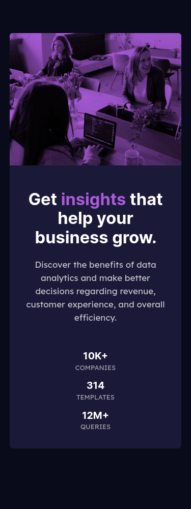

# Frontend Mentor - Stats preview card component solution

This is a solution to the [Stats preview card component challenge on Frontend Mentor](https://www.frontendmentor.io/challenges/stats-preview-card-component-8JqbgoU62). Frontend Mentor challenges help you improve your coding skills by building realistic projects. 

## Table of contents

- [Overview](#overview)
  - [The challenge](#the-challenge)
  - [Screenshot](#screenshot)
  - [Links](#links)
- [My process](#my-process)
  - [Built with](#built-with)
  - [What I learned](#what-i-learned)
  - [Continued development](#continued-development)
  - [Useful resources](#useful-resources)
- [Author](#author)
- [Acknowledgments](#acknowledgments)

## Overview

### The challenge

Users should be able to:

- View the optimal layout depending on their device's screen size
- Mobile: 375px
- Desktop: 1440px

### Screenshot

Mobile Version (375px)



Desktop Version (1440px)


### Links

- Solution URL: [Solution ](https://www.frontendmentor.io/solutions/stats-preview-card-components-finished-challenge-mfrCNSvkX)
- Live Site URL: [Live Site](https://ascecent.github.io/FrontEnd-Mentor-Challenge-Stats-preview-card-component/)

## My process

### Built with

- Semantic HTML5 markup
- CSS custom properties
- Flexbox
- Normalize CSS
- Web responsive workflow

### What I learned

I've learned about variables in CSS cause this is my first time using it, also a new CSS property: 

```css
element {
  mix-blend-mode: multiply;
}
```
Which describes the behavior of how the content of an element should be mixed with the content of the element behind it and the background.

### Continued development

I want to continue learning about how flex works and best practices to use it also i want to learn CSS grid for future projects and improve my skills in making a responsive website.

### Useful resources

- [mix-blend-mode](https://developer.mozilla.org/en-US/docs/Web/CSS/mix-blend-mode) - I have used this property to set the accent background, it helped me a lot :D. 
- [CSS Variables](https://developer.mozilla.org/en-US/docs/Web/CSS/Using_CSS_custom_properties) - Official documentation for the custom properties :D.

## Author

- Name - Ivan A. Holguin O.
- Frontend Mentor - [@Ascecent](https://www.frontendmentor.io/profile/Ascecent)
- LinkedIn - [@Ivan Holguin](https://www.linkedin.com/in/iv%C3%A1n-holgu%C3%ADn-7bb86a211/)

## Acknowledgments

I have seen the implementation of [Irs10](https://github.com/Irs10/preview-card) to get a bit of inspiration :D.